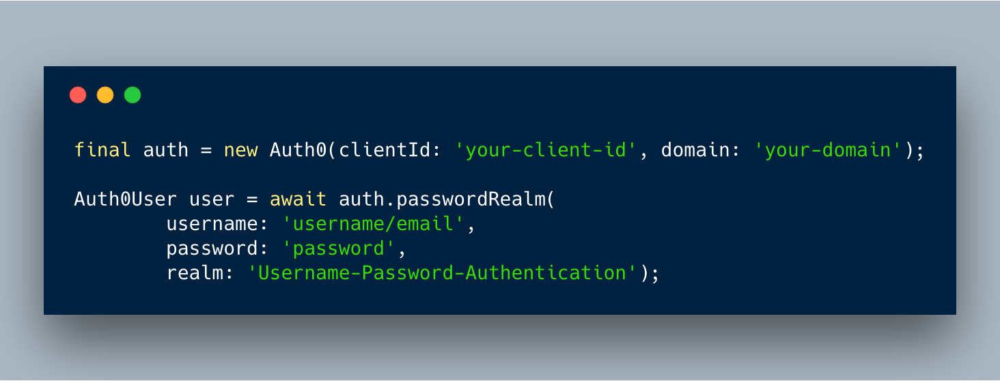
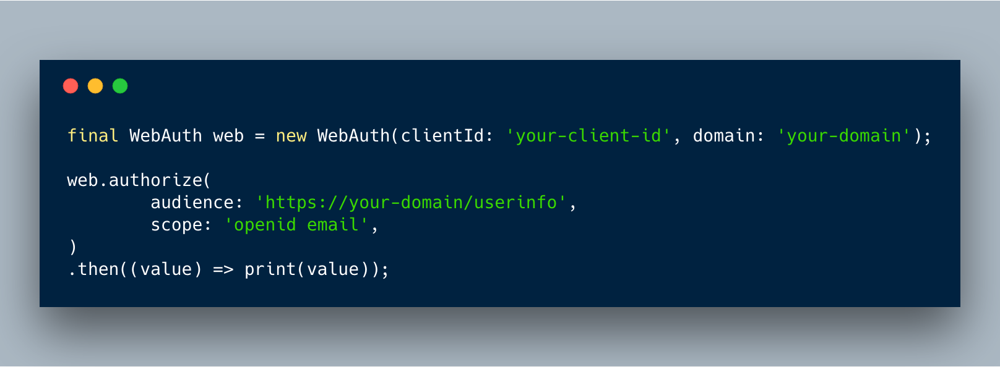
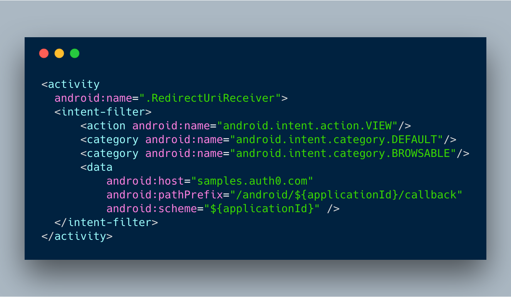
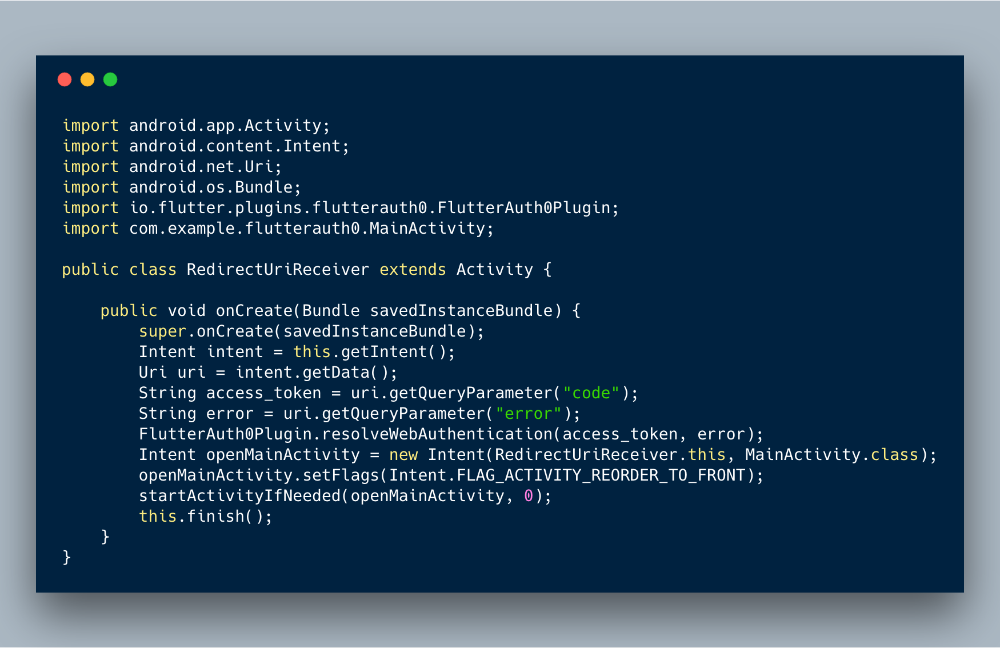

# flutter_auth0 plugin

A Flutter plugin to use the [Auth0 API & Auth0 PKCE flow](https://auth0.com/docs/api/authentication).

Note: This plugin is still under development, and some APIs might not be available yet. Feedback and Pull Requests are most welcome!

<div style="display:flex;flex-direction:row;">
    
    
    
</div>

## Authentication API
### Usage
To use this plugin, add `flutter_auth0` as a [dependency in your pubspec.yaml file](https://flutter.io/platform-plugins/).

## SignIn with email and password

To signin instance auth0 using `auth0-client-id` and `auth0-domain` and call signInWithEmailAndPassword function with email and password as params



### Using Authorization Code flow with PKCE


### Callback URL(s)
Callback URLs are the URLs that Auth0 invokes after the authentication process. Auth0 routes your application back to this URL and appends additional parameters to it, including a token. Since callback URLs can be manipulated, you will need to add this URL to your Application's Allowed Callback URLs for security. This will enable Auth0 to recognize these URLs as valid. If omitted, authentication will not be successful.

Go to the [Auth0 Dashboard](https://manage.auth0.com/#/applications), select your application and make sure that **Allowed Callback URLs** contains the following:

#### iOS

```text
{YOUR_BUNDLE_IDENTIFIER}://${YOUR_AUTH0_DOMAIN}/ios/{YOUR_BUNDLE_IDENTIFIER}/callback
```

#### Android

```text
{YOUR_APP_PACKAGE_NAME}://{YOUR_AUTH0_DOMAIN}/android/{YOUR_APP_PACKAGE_NAME}/callback
```

### To use
#### Android

In the file `android/app/src/main/AndroidManifest.xml` you must make sure the **MainActivity** of the app has a **launchMode** value of `singleTask` and add the following activity:

So if you have `samples.auth0.com` as your Auth0 domain you would have the following **MainActivity**  configuration:



Create the file **RedirectUriReceiver.java**



#### iOS
Inside the ios folder find the file AppDelegate.[swift|m] add the following to it


Inside the `ios` folder open the `Info.plist` and locate the value for `CFBundleIdentifier`, e.g.

```xml
<key>CFBundleIdentifier</key>
<string>$(PRODUCT_BUNDLE_IDENTIFIER)</string>
```

and then register a URL type entry using the value of `CFBundleIdentifier` as the value of `CFBundleURLSchemes`

```xml
<key>CFBundleURLTypes</key>
<array>
    <dict>
        <key>CFBundleTypeRole</key>
        <string>None</string>
        <key>CFBundleURLName</key>
        <string>auth0</string>
        <key>CFBundleURLSchemes</key>
        <array>
            <string>$(PRODUCT_BUNDLE_IDENTIFIER)</string>
        </array>
    </dict>
</array>
```

## Example

See the [example application](https://github.com/devdennysegura/flutter-auth0/tree/master/example) source
for a complete sample app using the auth0 authentication.

## What is Auth0?

Auth0 helps you to:

* Add authentication with [multiple authentication sources](https://docs.auth0.com/identityproviders), either social like **Google, Facebook, Microsoft Account, LinkedIn, GitHub, Twitter, Box, Salesforce, amont others**, or enterprise identity systems like **Windows Azure AD, Google Apps, Active Directory, ADFS or any SAML Identity Provider**.
* Add authentication through more traditional **[username/password databases](https://docs.auth0.com/mysql-connection-tutorial)**.
* Add support for **[linking different user accounts](https://docs.auth0.com/link-accounts)** with the same user.
* Support for generating signed [Json Web Tokens](https://docs.auth0.com/jwt) to call your APIs and **flow the user identity** securely.
* Analytics of how, when and where users are logging in.
* Pull data from other sources and add it to the user profile, through [JavaScript rules](https://docs.auth0.com/rules).

## Create a free Auth0 Account

1. Go to [Auth0](https://auth0.com) and click Sign Up.
2. Use Google, GitHub or Microsoft Account to login.

## Author

Denny Segura <dev.dennysegura@gmail.com>

This readme based on [react-native-auth0](https://github.com/auth0/react-native-auth0)

## License

This project is licensed under the MIT license. See the [LICENSE](LICENSE.txt) file for more info.